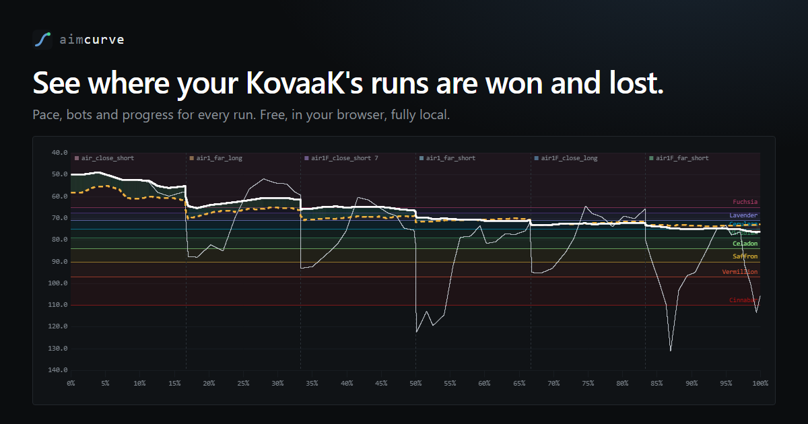
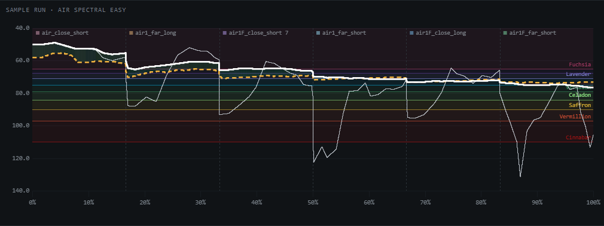
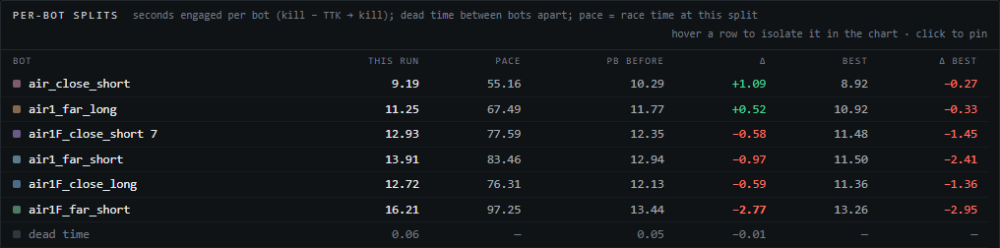
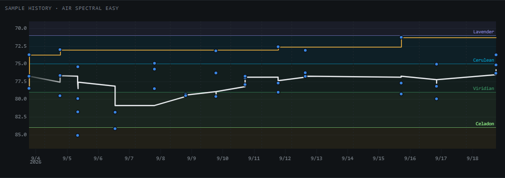

# aimcurve

**See where your KovaaK's runs are won and lost.**

aimcurve reads the stats KovaaK's already saves after every run and shows how each one
unfolded: where you pulled ahead, which bot cost you, and whether you are actually
getting better. It runs entirely in your browser.

**[Open aimcurve →](https://voidfill.github.io/aimcurve/)**



## What it shows

**Where the run slipped.** One chart per run: your projected final result as the run
unfolds, against your previous best, over the benchmark's rank bands. Hover anywhere
for the exact difference at that moment, and drag across any stretch to zoom in.



**The bot that costs you.** Every bot encounter, timed against the same baseline run,
with the biggest losses marked. Hover a row to light its encounters up on the chart.



**Whether you are improving.** Every run of a scenario over time: each run a dot, your
best so far and the median of your last ten as lines, so one lucky run cannot fake
progress.



## How to use it

1. Open [aimcurve](https://voidfill.github.io/aimcurve/).
2. Import the KovaaK's folder holding `stats` and `performances`.
3. After a session, import again to add the new runs.

## Privacy

Fully local. Your files are read and stored in your browser; there is no backend, no
account and no analytics. That also means your data does not sync between devices. To remove
everything aimcurve stored, use **Delete local data** on the Data page; your KovaaK's
files are never touched.

## Development

A static Vue 3 single-page application with a client-side Postgres (PGlite) and protobuf
codegen.

### Setup

```sh
nix develop      # node 24 LTS + corepack; pnpm pinned by package.json
pnpm install
```

### Scripts

| script             | what                                                   |
| ------------------ | ------------------------------------------------------ |
| `pnpm dev`         | vite dev server (port 4321, strict)                      |
| `pnpm build`       | static build to `dist/`                                 |
| `pnpm check`       | `vue-tsc --noEmit` (needs TypeScript 6.x, see below)     |
| `pnpm test`        | vitest, node environment (view suites opt into happy-dom) |
| `pnpm gen:proto`   | buf + protoc-gen-es → `src/gen/`                        |
| `pnpm gen:benchmarks` | refresh `src/data/benchmarks.json` from Evxl and KovaaK's |
| `pnpm gen:demo`    | regenerate `src/data/demo-snapshot.json`, the About page's sample data |
| `pnpm gen:demo-fixtures` | refresh `test/fixtures/demo/` from `raw/` ([preview assets](docs/preview-assets.md)) |
| `pnpm shots`       | recapture `public/og.png` and the README screenshots (needs `pnpm dev`) |
| `pnpm bench`       | vitest benchmarks (ingest throughput)                   |

### Layout

```
src/lib/     core calculation logic — pure, runs in the browser and in vitest
src/db/      migrations and the browser PGlite client
src/gen/     generated protobuf code
src/views/       top-level routed views
src/components/  shared UI components
src/composables/ shared reactive logic (Vue composables)
test/helpers shared test helpers (node-only)
test/fixtures  curated/ and demo/ are committed (Git LFS), raw/ is the gitignored dump
docs/        reverse-engineered format and ingest notes
```

**The core takes bytes, not paths.** Parsers accept `string` / `Uint8Array`, and
anything touching a database accepts a `PGliteInterface` rather than importing
`src/db/client.ts`.
That is what lets the same code run under vitest and in the browser — the only part
that differs is where the bytes come from (node `fs` in tests, a file picker in the
browser).

Tests sit next to their source (`src/**/*.test.ts`); `test/` holds only helpers and
fixtures, plus their own tests.

### Fixtures

`test/fixtures/raw/` is the full KovaaK's dump — ~4600 files, gitignored. Copy an
install's `performances/` and `stats/` into it to enable the sweep tests.

`test/fixtures/curated/` is the hand-picked, committed subset, tracked with **Git
LFS** — run `git lfs install` once after cloning, or the fixtures arrive as pointer
files and the suite fails. Everything that must pass on a fresh clone reads from
there; see [`curated/README.md`](test/fixtures/curated/README.md) for what each file
pins down and what earns a new one a place. Sweeps over the full dump guard on
`raw.available`:

`test/fixtures/demo/` holds the About page's sample runs, also in LFS. About never
reads the database: `pnpm test` ingests these into a test PGlite and checks the
committed `src/data/demo-snapshot.json` still matches what the real ingest and
queries produce. After changing ingest, migrations or queries, run `pnpm gen:demo`
and commit the result. Refreshing the sample runs, the link-preview card or the
screenshots is in [`docs/preview-assets.md`](docs/preview-assets.md).

```ts
import { curated, raw } from '../../test/helpers/fixtures';

describe.skipIf(!raw.available)('every stats file parses', () => { /* ... */ });
```

Data formats: `stats/*.csv` has three sections (kill table, weapon/settings table, a
`Key:,value` block). `performances/*.perf` is binary protobuf with no published
schema — a header message followed by repeated event records.

Pairing the two is not as simple as it looks: a run can produce a CSV with no `.perf`,
the two filenames can disagree by a second, and `Challenge Start` is not a unique key.
[`docs/ingest.md`](docs/ingest.md) covers all of it.

### Database

No server. `src/db/client.ts` runs PGlite in a dedicated worker (`src/db/worker.ts`) on
IndexedDB (`idb://`) in the browser; tests open an in-memory instance. Both apply
the same hand-written SQL.

Migrations are hand-written, numbered SQL files in `src/db/sql/`, named
`NNNN_<topic>.sql` — the filename is the migration's identity. They are loaded through
`import.meta.glob('./sql/*.sql', { query: '?raw' })` in `src/db/migrations.ts` and applied,
in ascending filename order, by `src/db/migrate.ts`, which tracks what has run in a
`_migrations` table — the browser database persists, so migration runs must be
idempotent. There is no ORM or schema generator: the schema leans on views, generated
columns, exclusion constraints, partial and covering indexes, triggers, and arrays with
alignment checks, and queries are hand-written SQL against `PGliteInterface`.

Adding a table: add a new `src/db/sql/NNNN_topic.sql`. Never edit an already-applied
one — see the reset rules below.

**Reset rules.** `applyMigrations` can decide the existing database can't be trusted,
and answers by dropping `public` and replaying every migration from scratch — which
means discarding all imported run history. Five conditions trigger this:

1. A pending migration declares itself destructive with `-- reset: <reason>` on its
   first line.
2. An already-applied migration's text changed since it ran. **Editing a migration file
   after it has shipped will wipe every user's local data on their next page load** —
   add a new file instead.
3. An applied migration's file has disappeared.
4. Applied migrations are out of step with the file list's order (e.g. a branch merge
   inserts a lower-numbered file after a higher one already ran).
5. The `_migrations` bookkeeping table predates hash tracking, so there is no hash to
   compare against.

Hashing normalizes line endings and trims trailing whitespace first, so a CRLF
checkout does not itself trip rule 2.

### Protobuf

`proto/*.proto` → `pnpm gen:proto` → `src/gen/*_pb.ts` (committed, so a fresh clone needs
no codegen). Uses `@bufbuild/protobuf`'s schema API: `create`, `toBinary`, `fromBinary`.

### Notes

- `typescript` is pinned to 6.x: `vue-tsc`'s own `peerDependencies` accept
  `typescript >=5.0.0` with no upper bound, so nothing in `vue-tsc` itself forces this
  cap. The pin stays because TypeScript 7 is not published as a stable release yet
  (only `7.x-dev` prereleases exist), so the project tracks the latest released 6.x
  line rather than an unstable prerelease.
- PGlite is excluded from Vite's dep pre-bundling (`vite.config.ts`) because it ships
  wasm and a worker. The `eval` warnings during build come from its wasm loader.
